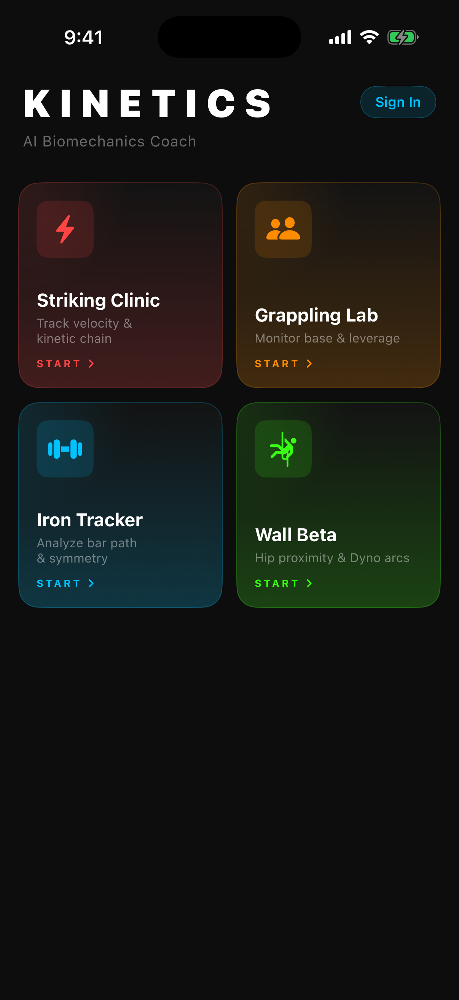

# Kinetics — AI Biomechanics Coach

A native iOS super-app that uses Apple's Vision Framework to coach athletes in real-time across four sports. Point your camera at yourself and Kinetics analyses your movement instantly, on-device. After a session, an AI coach powered by Claude generates a personalised breakdown of your technique.

---

## Screenshots

| Home & Feed | Live Session | Session Report |
|:-----------:|:------------:|:--------------:|
|  |  |  |

| Gym Tracker | Discover | Profile |
|:-----------:|:--------:|:-------:|
|  |  |  |

> **To update screenshots:** build in Xcode → run on simulator → `xcrun simctl io booted screenshot docs/screenshots/XX_name.png`

---

## What It Does

Kinetics is intentionally over-featured. Firebase Analytics tracks which module drives the most engagement over 60 days. The winner gets spun off as a standalone premium app.

### Four Expert Coaching Modules

| Module | Sport | What's Tracked |
|--------|-------|----------------|
| **Striking Clinic** | MMA / Karate / TKD | Strike velocity (MPH), kinetic chain score, hip-to-shoulder separation |
| **Grappling Lab** | BJJ / Judo | Center-of-mass stability, kuzushi index, spine angle, postural breaks |
| **Iron Tracker** | Powerlifting / Weightlifting | Bar path deviation, VBT velocity (m/s), bilateral symmetry, butt wink |
| **Wall Beta** | Bouldering / Sport Climbing | Hip proximity score (0–100), sag detection, Dyno arc, time-under-tension |

### Everything Else

- **AI Coach** — after every session, Claude analyses your metrics and writes a sport-specific coaching report with prioritised corrections
- **Social Feed** — auto-publish sessions, react with emoji, comment, follow athletes, share post-session PR cards
- **Gym Tracker** — SwiftData-backed routine builder with muscle-group filters, VBT velocity logging, and advanced analytics (strength curves, volume trends)
- **GPS Track** — real-time pace/distance with MapKit dark-map overlay and Strava route import
- **Video Analysis** — import workout video, upload to Firebase Storage, get AI sport detection and form breakdown
- **Apple Watch** — WatchKit companion streams heart rate, shows elapsed time, and exposes quick-start for all 5 modules
- **Community Routes** — discover routes from Strava, MapKit-generated loops, or the Kinetics community
- **Streak & Achievements** — Lottie-animated unlock cards, fire streak badge, WidgetKit home screen widget

---

## Architecture

```
AVCaptureSession (30fps, 1280×720)
    └── CameraManager ──► AsyncStream<CMSampleBuffer>
            ├── PoseDetectionEngine (actor)
            │       └── VNSequenceRequestHandler → VNDetectHumanBodyPoseRequest
            │                                    → JointPose (19 joints, temporal smoothing)
            └── TrajectoryTracker (actor)
                    └── VNDetectTrajectoriesRequest → [TrajectoryPath]

JointPose
    ├── StrikingAnalytics  → StrikingViewModel (@Observable @MainActor)  → StrikingView
    ├── GrapplingAnalytics → GrapplingViewModel                          → GrapplingView
    ├── IronTrackerAnalytics → IronTrackerViewModel                      → IronTrackerView
    └── WallBetaAnalytics  → WallBetaViewModel                           → WallBetaView

Firebase Auth      → AuthManager      → AppState (@Observable)
Firebase Firestore → SessionRepository → session / activity / users / routes
Firebase Storage   → VideoStorageService → uploaded video + AI report
Firebase Analytics → module_session_started / module_session_completed

SwiftData          → GymTracker (workouts, sets, exercises — local first)
HealthKit          → HR, calories, step count
CoreLocation       → GPS track with background location
WatchConnectivity  → iOS ↔ watchOS metrics bridge
StoreKit 2         → SubscriptionManager (monthly / annual)
Lottie             → confetti, fire streak, heartbeat, location pin, run animation
```

---

## Tech Stack

| Layer | Technology | Why this, not that |
|-------|------------|-------------------|
| Language | Swift 6 (strict concurrency) | Actor isolation eliminates data races without locks |
| UI | SwiftUI iOS 17+ | `@Observable` macro, `NavigationStack`, no UIKit |
| State | `@Observable @MainActor` ViewModels | Replaces `ObservableObject` + `@Published` entirely |
| Vision | Apple Vision Framework | On-device, zero latency, no API cost |
| Camera | AVFoundation → `AsyncStream` | Clean backpressure without Combine |
| Local data | SwiftData | GymTracker needs offline-first with complex queries |
| Remote data | Firebase Firestore | Real-time feed, cross-device sessions, social graph |
| AI coaching | Claude API (`claude-opus-4-5`) | Sport-specific reasoning, personalised corrections |
| Project gen | xcodegen 2.45+ | Single `project.yml` source of truth, no merge conflicts |
| Animations | Lottie (airbnb/lottie-spm) | Achievement unlock, streak, map pin — fluid and cancellable |
| Watch | WatchKit + WatchConnectivity | HR overlay without relying on HealthKit polling |

**Rejected:** CoreML (Vision Framework already wraps the COCO pose model), Combine (`AsyncStream` is cleaner and Swift 6 native), `ObservableObject` (migration complete — all services use `@Observable`).

---

## Technical Deep-Dive

### The Camera–Actor Bridge Problem

The hardest problem was bridging AVFoundation's delegate callbacks — which fire on a private background queue — into Swift 6's strict actor system without deadlocks or data races.

`CameraManager` creates an `AsyncStream<CMSampleBuffer>` in `init`. The AVFoundation capture delegate stores the `AsyncStream.Continuation` as `nonisolated(unsafe)` — the only valid escape hatch for a Sendable closure that must capture a non-Sendable type from a background thread. Each frame yielded to the stream is consumed by exactly one ViewModel's `for await buffer in cameraManager.frameStream` loop. The active module owns the consumer; all others ignore frames. No setup/teardown races, no duplicate processing.

`PoseDetectionEngine` uses `VNSequenceRequestHandler` (not `VNImageRequestHandler`) so the model can carry temporal state across frames. This halves joint jitter compared to per-frame detection.

### Why `@Observable` Tracking Fails in `UIViewRepresentable`

`CameraPreviewView` wraps `AVCaptureVideoPreviewLayer` in a `UIViewRepresentable`. Early versions passed the entire `CameraManager` as a parameter, expecting SwiftUI to re-call `updateUIView` when `previewLayer` changed. It never did.

`@Observable` tracking only runs during SwiftUI's `body` evaluation. Inside `updateUIView`, there is no observation context — property accesses are invisible to the tracking system. The fix: pass `previewLayer: AVCaptureVideoPreviewLayer?` directly. Now SwiftUI reads `previewLayer` during `body`, registers the dependency, and `updateUIView` fires on every change.

### Feed Data Model

The Firestore activity feed uses a flat `activity/{id}` collection with a top-level `userId` field for efficient `whereField` queries, plus sub-collections `kudos/{uid}` and `comments/{id}` for social interactions. Reaction tallies are read in a single parallel `withTaskGroup` alongside kudos resolution, then merged into each `FeedItem` before the page is returned — no N+1 reads.

---

## Sport Analytics Details

### Striking
Hip angular velocity vs. shoulder angular velocity. Hips must fire before shoulders for maximum kinetic chain transfer. Strike detection uses a rising-edge threshold on wrist velocity (>5 mph triggers a strike event). Post-session report shows per-strike separation angle and velocity.

### Grappling
CoM = centroid of `leftHip + rightHip`. Base polygon = `leftAnkle + rightAnkle + leftKnee + rightKnee`. Point-in-polygon test determines stability. Kuzushi = `neck→root` vector angle vs. vertical — measures postural displacement before a throw.

### Iron Tracker
Bar path = `(leftWrist + rightWrist) / 2`. Velocity uses calibration constant `1280px ≈ 2m`. Butt wink: `leftHip–root–leftKnee` angle < 70° at squat bottom. Bilateral symmetry: left vs. right wrist Y-ascent speed delta as a percentage.

### Wall Beta
Hip proximity score: horizontal distance from left edge (proxy for wall) mapped to 0–100. Sag: hip Y drops >5% below session baseline. Dyno: wrist velocity > 8 mph AND hips moving upward simultaneously.

---

## Install & Run

### Prerequisites

- Xcode 16.2+
- iOS 17.0+ physical device (Vision Framework body pose requires real hardware)
- [xcodegen](https://github.com/yonaskolb/XcodeGen): `brew install xcodegen`
- Firebase project (instructions below)

### Quick Start

```bash
git clone https://github.com/rayancheca/kinetics.git
cd kinetics
xcodegen generate
```

Create `Kinetics/Config/Secrets.xcconfig` (this file is gitignored — you must create it locally):

```
STRAVA_CLIENT_ID = your_strava_client_id
STRAVA_CLIENT_SECRET = your_strava_client_secret
CLAUDE_API_KEY = sk-ant-api03-your_key_here
```

Then open in Xcode:

```bash
open Kinetics.xcodeproj
```

1. Select your Apple Developer team under **Signing & Capabilities**
2. Connect your iPhone
3. Press **⌘R**

### Firebase Setup

1. Create a project at [console.firebase.google.com](https://console.firebase.google.com)
2. Add an iOS app with bundle ID `com.rayancheca.kinetics`
3. Download `GoogleService-Info.plist` → replace `Kinetics/Resources/GoogleService-Info.plist`
4. Enable: **Authentication** (Sign in with Apple + Email), **Firestore**, **Storage**, **Analytics**
5. Deploy security rules: `firebase deploy --only firestore:rules` (see `FIREBASE_DEPLOY.md`)

### Claude API Key (for AI coaching)

Get a key at [console.anthropic.com](https://console.anthropic.com) and add it to `Secrets.xcconfig` as shown above. Without it, the AI coaching card shows a "key not configured" banner — all other features work normally.

---

## Project Structure

```
Kinetics/
├── App/              KineticsApp, AppState, OnboardingView, SplashScreenView
├── Config/           Secrets.xcconfig (gitignored — create locally)
├── Core/
│   ├── Vision/       CameraManager, PoseDetectionEngine, TrajectoryTracker
│   ├── Analytics/    BiomechanicsCalculator
│   ├── Models/       JointPose, SessionResult, SportType, FeedItem, UserProfile
│   ├── Services/     AICoachService, CoachVoice, KeychainHelper, StravaAuthService
│   └── Coaching/     CoachingEngine, LiveCoachingMetrics, CoachCue
├── Modules/
│   ├── StrikingClinic/
│   ├── GrapplingLab/
│   ├── IronTracker/
│   ├── WallBeta/
│   ├── GymTracker/   SwiftData-backed routine builder + progress analytics
│   ├── Social/       Feed, FeedViewModel, SocialRepository, PostComposer, Discover
│   ├── Track/        GPS map, RouteDiscovery, Strava + MapKit + Community routes
│   ├── VideoAnalysis/ upload, AI detection, VideoReportViewModel
│   └── Subscription/ PaywallView, SubscriptionManager (StoreKit 2)
├── Shared/
│   ├── Components/   CameraPreviewView, PoseOverlayView, MetricsCardView
│   └── Extensions/   Color+Kinetics, Font+Kinetics
├── Firebase/         AuthManager, SessionRepository, SessionFeedPublisher
├── Home/             HomeView, HomeViewModel, HomeCards
├── Resources/        Assets, Lottie JSONs, GoogleService-Info.plist
├── KineticsWatch/    WatchKit companion (WatchActiveSessionView, HR, timer)
├── KineticsWidget/   WidgetKit extension (streak, last session)
├── firestore.rules   Production Firestore security rules
├── firestore.indexes.json  Composite index for feed queries
├── project.yml       xcodegen spec (source of truth for .xcodeproj)
└── FIREBASE_DEPLOY.md  Exact commands to deploy rules and indexes
```

---

## Roadmap

- [x] Phase 1: Four modules + social + gym + GPS + AI coaching + WatchKit
- [ ] Phase 2: 60-day Firebase Analytics collection — measure module engagement
- [ ] Phase 3: Spin off highest-engagement module as standalone $4.99/month app
- [ ] Video AI sport detection accuracy improvements
- [ ] Coach mode: annotate recordings for remote coaching
- [ ] Rep auto-counting via VNDetectTrajectoriesRequest on wrist path
